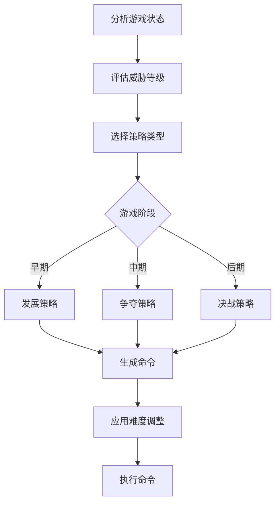

# 三国策略对战游戏 (Xian Game)

基于行为树技术的三国策略对战游戏，使用 [mistreevous](https://github.com/nikkorn/mistreevous) 行为树库实现智能AI。

## 项目特点

- ✅ **完整游戏实现**：严格按照游戏规则文档实现的策略对战游戏
- ✅ **智能AI系统**：使用行为树技术和mistreevous库实现的高级AI
- ✅ **多难度支持**：简单、普通、困难、专家四个AI难度等级
- ✅ **完整测试框架**：基于Jest的全面测试套件
- ✅ **详细中文注释**：代码包含丰富的中文注释和文档
- ✅ **模块化设计**：清晰的架构和职责分离

## 游戏规则概览

### 地图系统
- **地图尺寸**：80×60静态地图
- **地形类型**：空地、山丘、水域、龙旗据点、城寨、基地
- **距离计算**：切比雪夫距离 max(Δx, Δy)

### 武将系统
- **猛将类**：吕布、赵云、关羽（高攻击力100，低统帅6，体力1500）
- **统帅类**：刘备、曹操、孙权（中等攻击力60，高统帅12，体力1600）
- **谋士类**：诸葛亮、周瑜、司马懿（低攻击力50，中等统帅8，体力1200）

### 兵种系统
- **弓兵**：武力25，体力240
- **盾兵**：武力15，体力400
- **承伤顺序**：盾兵 → 弓兵 → 武将

### 经济系统
- **初始粮草**：100，上限1500
- **生产成本**：每个士兵消耗20粮草
- **击杀奖励**：击杀武将获得粮草和士气奖励

### 胜利条件
- **龙旗据点**：连续控制60回合获胜
- **回合上限**：1000回合后比较据点控制时间

## 项目结构

```
xian-game-2025/
├── src/                    # 源代码目录
│   ├── core/              # 核心游戏逻辑
│   │   ├── GameConstants.js    # 游戏常量和配置
│   │   ├── GameMap.js         # 地图管理类
│   │   └── GameEngine.js      # 游戏引擎主类
│   ├── entities/          # 游戏实体
│   │   └── General.js         # 武将类
│   ├── ai/                # AI系统
│   │   ├── BehaviorTree.js    # 行为树实现
│   │   └── AIController.js    # AI控制器
│   └── Game.js            # 主游戏类
├── tests/                 # 测试文件
│   ├── GameEngine.test.js     # 游戏引擎测试
│   ├── AIController.test.js   # AI控制器测试
│   └── NetworkClient.test.js  # 网络客户端测试
├── examples/              # 示例代码
│   ├── basic-game.js          # 基础游戏示例
│   └── network-example.js     # 网络通信示例
├── package.json           # 项目配置
├── babel.config.js        # Babel配置
├── .eslintrc.js          # ESLint配置
└── README.md             # 项目文档
```

## 安装和运行

### 环境要求
- Node.js 16+ 
- npm 7+

### 安装依赖
```bash
npm install
```

### 运行示例
```bash
# 运行基础游戏示例
node examples/basic-game.js

# 或使用npm脚本
npm run example
```

### 运行测试
```bash
# 运行所有测试
npm test

# 运行测试并查看覆盖率
npm run test:coverage

# 监听模式运行测试
npm run test:watch
```

### 代码检查
```bash
# 运行ESLint检查
npm run lint

# 自动修复代码问题
npm run lint:fix
```

## 使用方法

### 基础用法

```javascript
import XianGame from './src/Game.js';

// 创建游戏实例
const game = new XianGame({
  player1Type: 'ai',        // 'ai' | 'human'
  player2Type: 'ai',        // 'ai' | 'human'
  ai1Difficulty: 'normal',  // 'easy' | 'normal' | 'hard' | 'expert'
  ai2Difficulty: 'hard',    // 'easy' | 'normal' | 'hard' | 'expert'
  autoPlay: true,           // 是否自动进行游戏
  gameSpeed: 'normal',      // 'slow' | 'normal' | 'fast' | 'instant'
  logLevel: 'info'          // 'debug' | 'info' | 'warn' | 'error'
});

// 开始游戏
const result = await game.startGame();
console.log('游戏结果:', result);
```

### 高级用法

```javascript
// 批量运行游戏进行AI性能测试
const results = await XianGame.runBatch(100, {
  player1Type: 'ai',
  player2Type: 'ai',
  ai1Difficulty: 'expert',
  ai2Difficulty: 'expert'
});

// 手动控制游戏进程
const game = new XianGame({ autoPlay: false });
await game.startGame();

// 执行单个回合
await game.executeSingleTurn();

// 查看游戏状态
const gameState = game.getGameState();
```

## AI系统详解

### 行为树架构

本项目使用mistreevous库实现的行为树AI系统，具有以下特点：

1. **多层决策结构**
   - 游戏阶段分析（早期/中期/后期）
   - 威胁等级评估
   - 策略选择（进攻/防守/平衡）

2. **智能黑板系统**
   - 存储AI状态和决策数据
   - 动态更新威胁评估
   - 记录历史决策信息

3. **多策略支持**
   - **早期策略**：专注发展和资源积累
   - **中期策略**：开始进攻和据点争夺
   - **后期策略**：全力争夺胜利条件

### AI难度等级

| 难度 | 反应时间 | 错误率 | 计划深度 | 资源管理 | 特点 |
|------|----------|--------|----------|----------|------|
| 简单 | 2000ms | 15% | 1层 | 60% | 适合新手，决策较慢 |
| 普通 | 1000ms | 8% | 2层 | 80% | 平衡的AI对手 |
| 困难 | 500ms | 3% | 3层 | 90% | 有挑战性的对手 |
| 专家 | 100ms | 1% | 4层 | 100% | 最高难度，接近完美 |

### AI决策流程



## 测试框架

### 测试覆盖范围

- **游戏引擎测试**：核心功能、武将系统、战斗系统、回合系统
- **AI控制器测试**：决策能力、行为树功能、难度调整、性能统计
- **集成测试**：完整游戏流程、AI对战、边界条件处理

### 运行测试

```bash
# 运行所有测试
npm test

# 运行特定测试文件
npm test GameEngine.test.js

# 查看测试覆盖率
npm run test:coverage
```

### 测试示例

```javascript
// 测试AI决策能力
test('AI应该能够生成决策命令', async () => {
  const result = await aiController.executeTurn();
  
  expect(result.success).toBe(true);
  expect(result.commandsExecuted).toBeGreaterThanOrEqual(0);
  expect(Array.isArray(result.results)).toBe(true);
});

// 测试游戏引擎
test('应该能够选择武将', () => {
  const result = gameEngine.processPlayerCommand(PLAYERS.PLAYER1, {
    type: COMMANDS.PICK,
    data: { generalName: '吕布', position: { x: 10, y: 10 } }
  });

  expect(result.success).toBe(true);
  expect(result.generalId).toBeDefined();
});
```

## 性能优化

### AI性能优化

1. **决策缓存**：缓存常用的计算结果
2. **路径预计算**：预计算常用路径和位置
3. **异步执行**：使用异步模式避免阻塞
4. **内存管理**：及时清理不必要的数据

### 游戏引擎优化

1. **事件驱动**：基于事件的状态更新
2. **增量更新**：只更新变化的部分
3. **批量操作**：合并多个操作提高效率

## 扩展开发

### 添加新武将

```javascript
// 在GameConstants.js中添加武将数据
const NEW_GENERAL = {
  name: '新武将',
  type: 'mighty',
  health: 1500,
  attackPower: 100,
  commandPower: 6,
  attackRange: 2,
  skills: {
    // 定义技能
  }
};
```

### 实现新技能

```javascript
// 在General.js中添加技能实现
useCustomSkill(targets, currentTurn, gameMap) {
  // 技能逻辑实现
  return {
    success: true,
    message: '技能执行成功',
    effects: []
  };
}
```

### 创建新AI策略

```javascript
// 在BehaviorTree.js中添加新策略
executeCustomStrategy() {
  const commands = this.blackboard.get('commands');
  
  // 实现自定义策略逻辑
  
  return 'SUCCESS';
}
```

## 贡献指南

1. Fork 项目
2. 创建功能分支：`git checkout -b feature/new-feature`
3. 提交更改：`git commit -am 'Add new feature'`
4. 推送分支：`git push origin feature/new-feature`
5. 创建 Pull Request

### 代码规范

- 使用ES6+语法
- 遵循ESLint配置
- 添加详细的中文注释
- 编写对应的测试用例
- 保持代码覆盖率在90%以上

## 技术栈

- **语言**：JavaScript (ES6+)
- **行为树**：[mistreevous](https://github.com/nikkorn/mistreevous)
- **测试框架**：Jest
- **代码规范**：ESLint
- **构建工具**：Babel

## 许可证

MIT License

## 更新日志

### v1.0.0 (2025-01-XX)
- 初始版本发布
- 完整的游戏引擎实现
- 基于mistreevous的AI行为树系统
- 全面的测试覆盖
- 详细的中文文档

---

## 联系方式

如有问题或建议，请提交Issue或联系开发团队。

**开发目标**：创建一个具有高胜率AI的三国策略对战游戏，展示行为树技术在游戏AI中的应用。 